# Ephraim Care Portal — Handover Guide with Test Phase Screenshots
*Prepared by OpBros.ai — February 27, 2026*

---

## Overview
This document provides a concise handover guide for the Ephraim Care NDIS portal. For each key page, you will find a screenshot taken during the automated Playwright test run, together with the **Test Phase**, any **Error** (none for all passing tests), and the **Result**.

---

## Admin Portal Screenshots

- **Test Phase:** Admin login page loads.
- **Error:** None.
- **Result:** ✅ Passed.

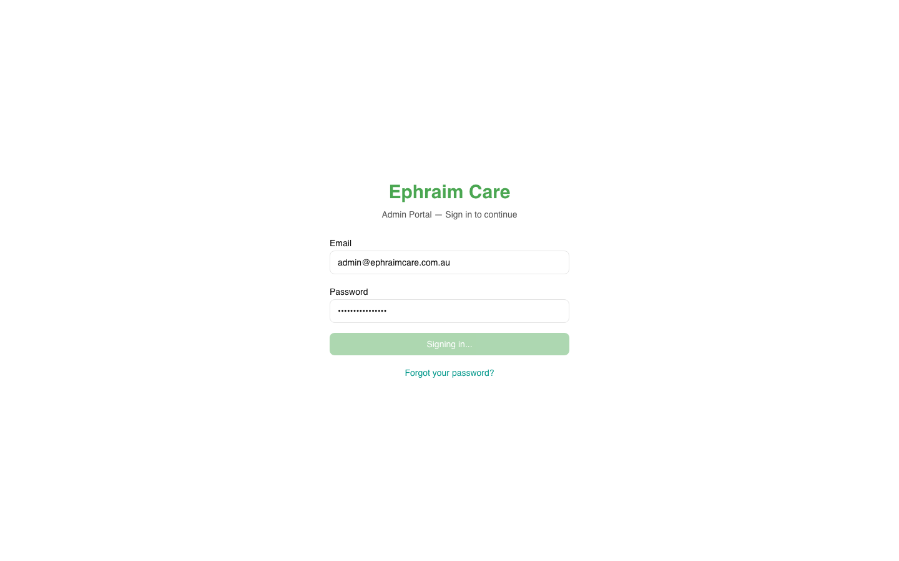
- **Test Phase:** Dashboard after successful login.
- **Error:** None.
- **Result:** ✅ Passed.

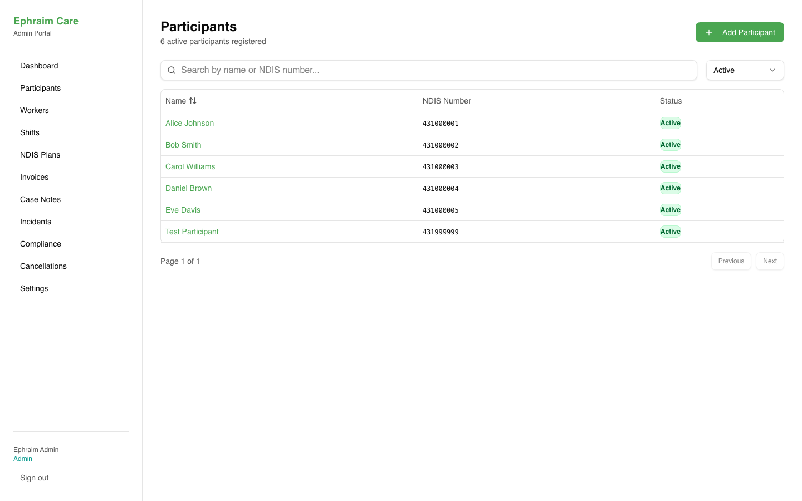
- **Test Phase:** Navigate to Participants page.
- **Error:** None.
- **Result:** ✅ Passed.

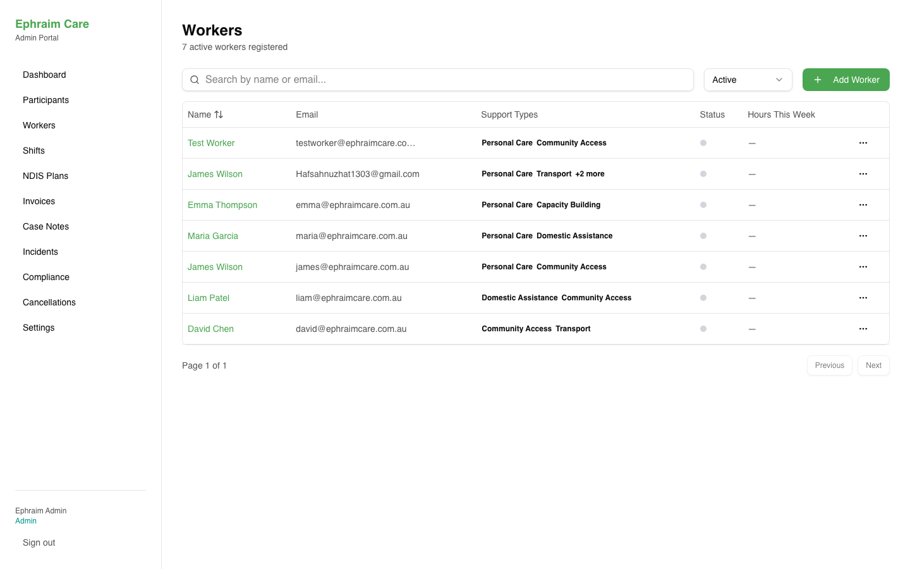
- **Test Phase:** Navigate to Workers page.
- **Error:** None.
- **Result:** ✅ Passed.

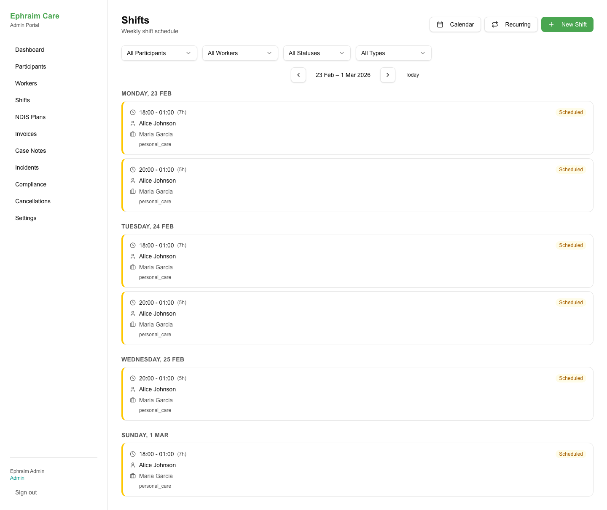
- **Test Phase:** Open Shifts page.
- **Error:** None.
- **Result:** ✅ Passed.

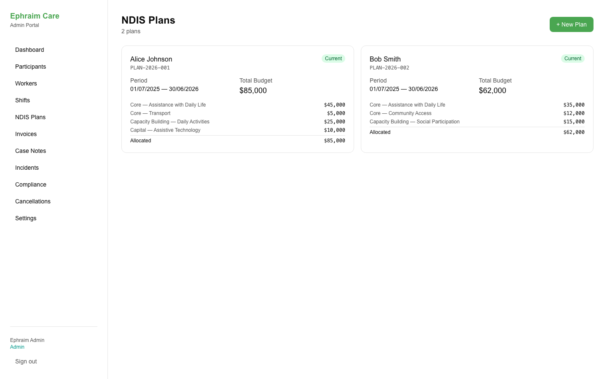
- **Test Phase:** View NDIS Plans page.
- **Error:** None.
- **Result:** ✅ Passed.

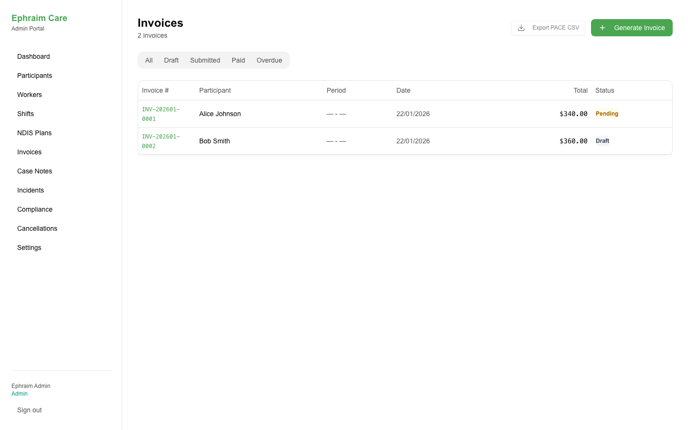
- **Test Phase:** Open Invoices page.
- **Error:** None.
- **Result:** ✅ Passed.

- **Test Phase:** Access Case Notes.
- **Error:** None.
- **Result:** ✅ Passed.

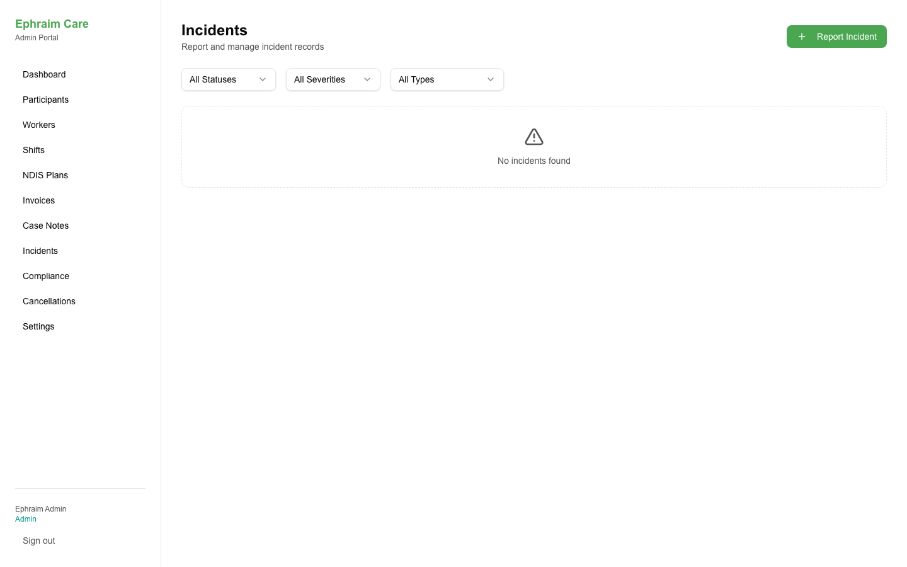
- **Test Phase:** Open Incidents page.
- **Error:** None.
- **Result:** ✅ Passed.

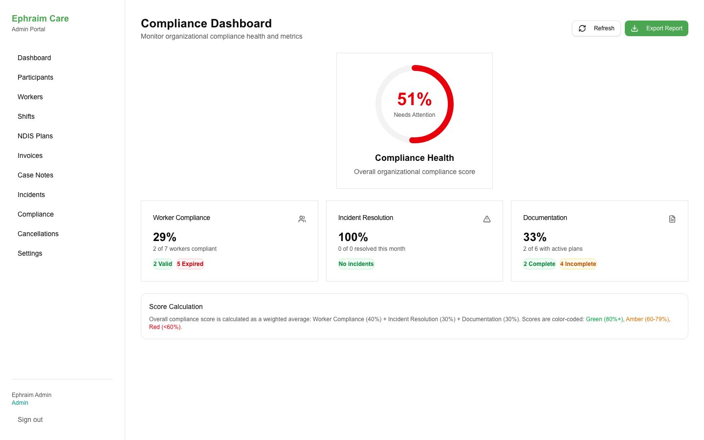
- **Test Phase:** Load Compliance Dashboard.
- **Error:** None.
- **Result:** ✅ Passed.

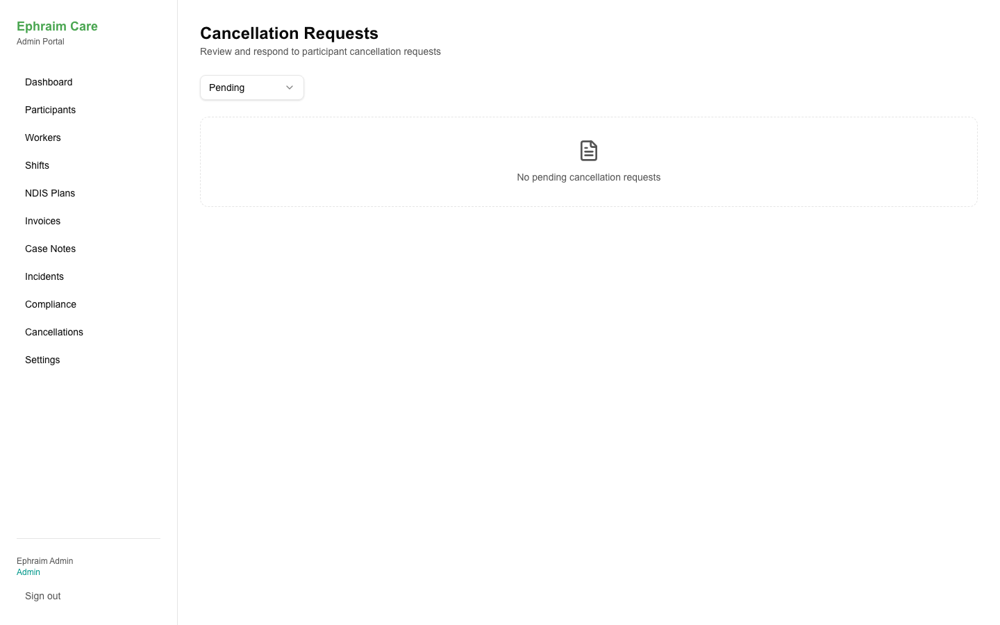
- **Test Phase:** View Cancellations page.
- **Error:** None.
- **Result:** ✅ Passed.

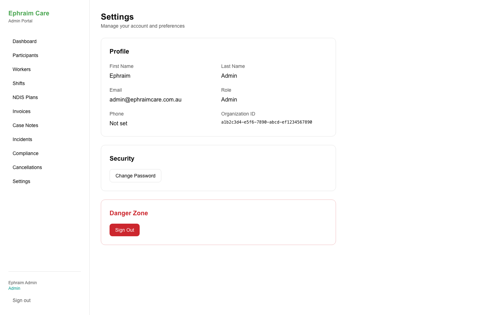
- **Test Phase:** Open Settings page.
- **Error:** None.
- **Result:** ✅ Passed.

---

## Participant Portal Screenshots

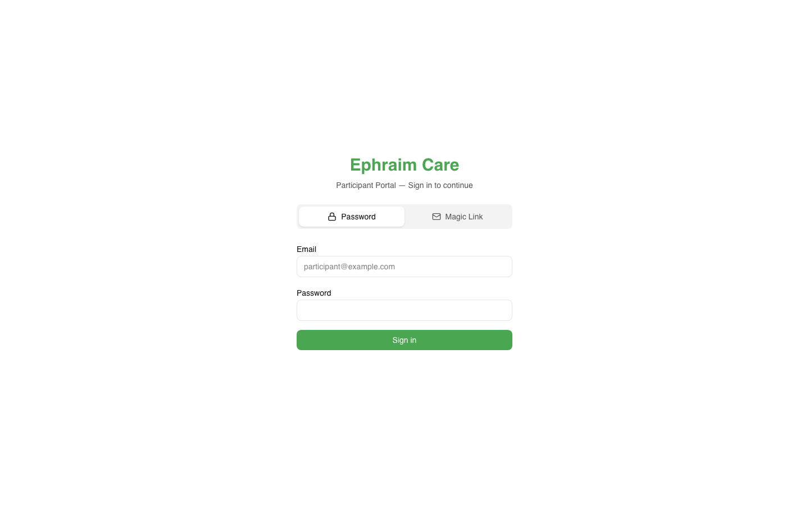
- **Test Phase:** Participant login page loads.
- **Error:** None.
- **Result:** ✅ Passed.

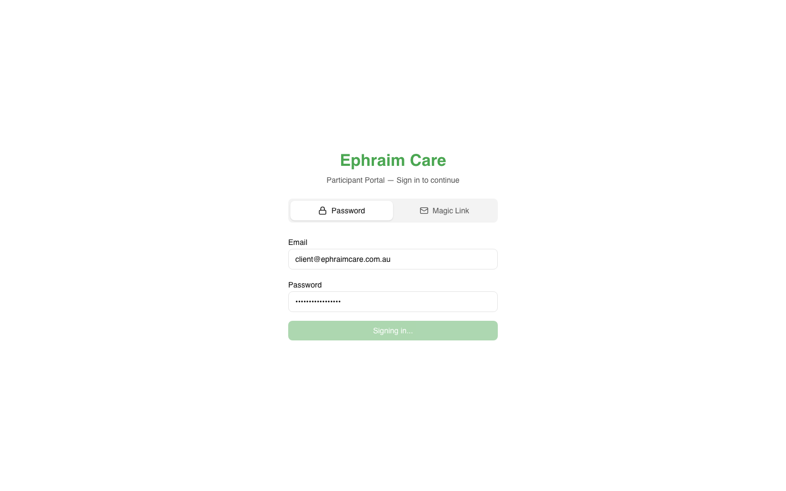
- **Test Phase:** Dashboard after participant login.
- **Error:** None.
- **Result:** ✅ Passed.

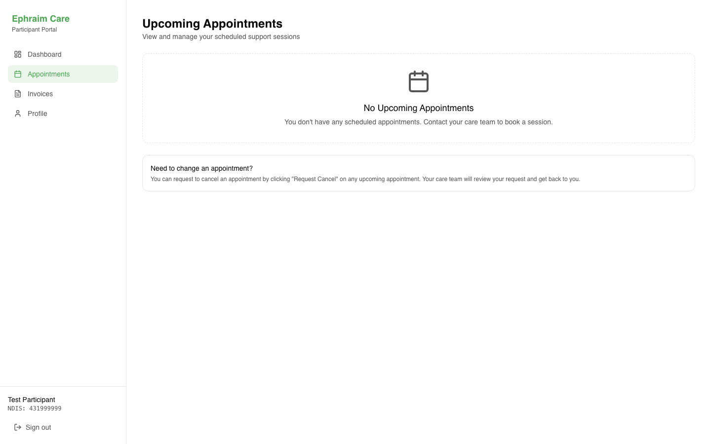
- **Test Phase:** View Appointments page.
- **Error:** None.
- **Result:** ✅ Passed.

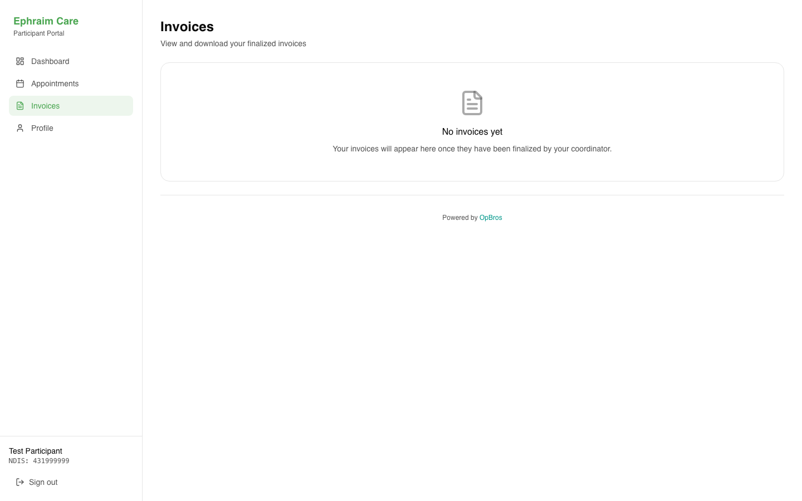
- **Test Phase:** Open Invoices page.
- **Error:** None.
- **Result:** ✅ Passed.

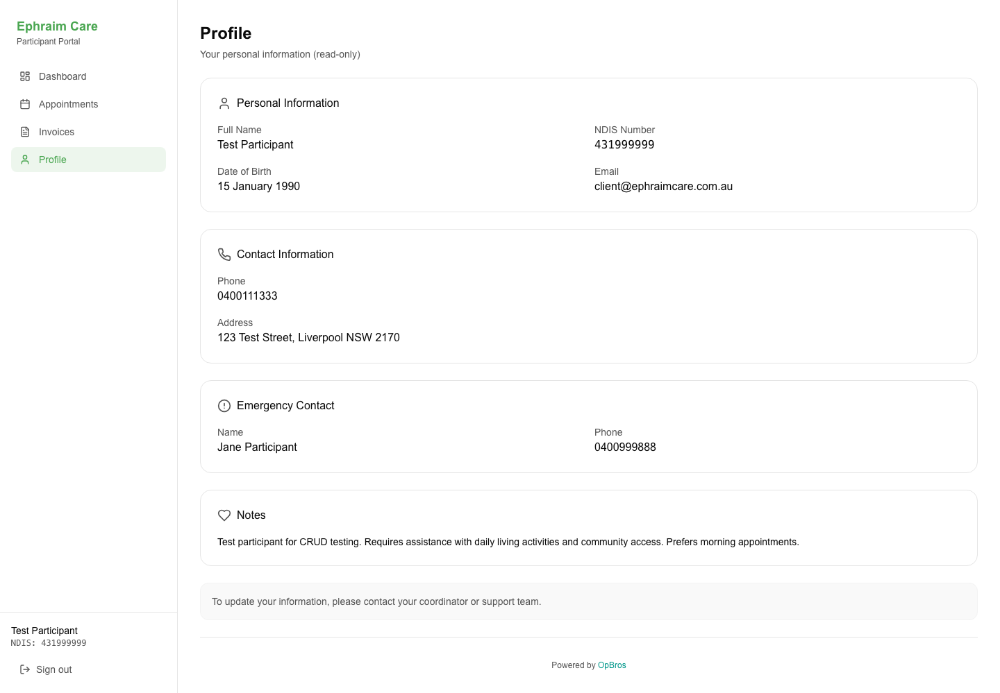
- **Test Phase:** View Profile page.
- **Error:** None.
- **Result:** ✅ Passed.

---

*All screenshots were captured from the live Vercel deployments during the automated test run on February 27, 2026.*
