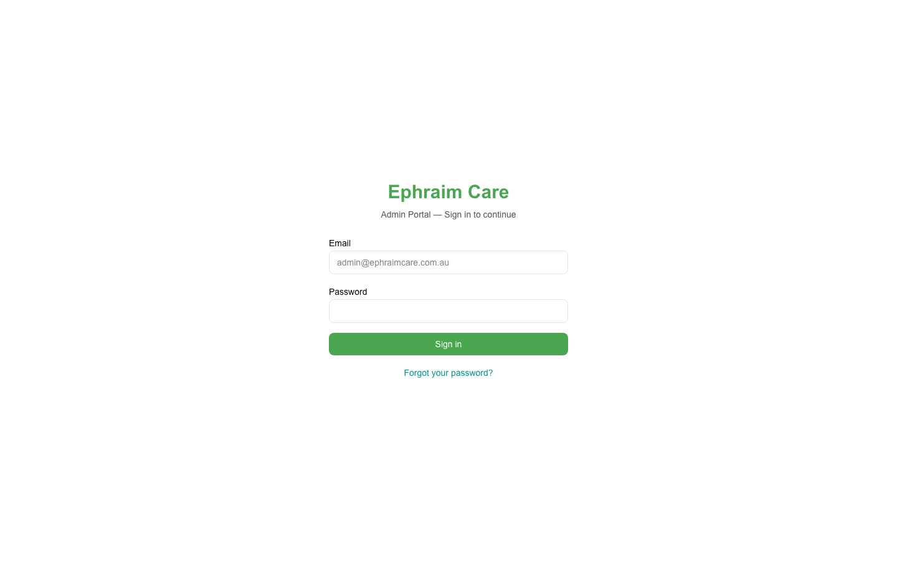

# Ephraim Care Portal — Complete Handover Guide
*Prepared by OpBros.ai — February 27, 2026*
*For: Meshach, Ephraim Care, Liverpool NSW*

---

## 🌐 Your Two Portals

| Portal | Link | Who Uses It |
|--------|------|------------|
| **Admin Portal** | [ephraimcare-ndis-portal-admin.vercel.app](https://ephraimcare-ndis-portal-admin.vercel.app) | You (admin), coordinators |
| **Participant Portal** | [ephraimcare-participant-portal.vercel.app](https://ephraimcare-participant-portal.vercel.app) | NDIS participants & families |

The **Worker Mobile App** runs through Expo Go on a phone — contact OpBros for setup.

---

## 🔑 Login Details

### Admin Portal

| Who | Email | Password |
|-----|-------|----------|
| **Admin (You)** | admin@ephraimcare.com.au | EphraimAdmin2026 |
| **Coordinator** | sarah@ephraimcare.com.au | EphraimCoord2026 |

### Participant Portal (Test Account)

| Who | Email | Password |
|-----|-------|----------|
| **Test Participant** | client@ephraimcare.com.au | EphraimClient2026 |

### Sample Workers (for testing)

| Name | Email | Password |
|------|-------|----------|
| James Wilson | james@ephraimcare.com.au | EphraimWorker2026 |
| Emma Thompson | emma@ephraimcare.com.au | EphraimWorker2026 |
| Maria Garcia | maria@ephraimcare.com.au | EphraimWorker2026 |
| Liam Patel | liam@ephraimcare.com.au | EphraimWorker2026 |
| David Chen | david@ephraimcare.com.au | EphraimWorker2026 |

> **Workers cannot log into the Admin or Participant portals.** They only use the mobile app.

---

## 📸 Admin Portal — Every Page Explained

### 🔐 Login Page

This is the first page you see. Type your email and password here to enter the portal. If the wrong email/password is entered, it shows an error — nobody can break in by guessing.

---

### 🏠 Dashboard (Your Home Screen)

This is what you see after logging in. Think of it like the front page of a newspaper — the most important information at a glance:
- How many participants you have
- How many workers are registered
- Today's shifts
- Invoices waiting to be sent

Use the **left sidebar** to go anywhere in the system.

---

### 👥 Participants

A list of every NDIS participant you support. Each row shows their name, NDIS number, and whether they're active. Click anyone's name to see their full profile — contact details, NDIS plan, invoices, and shift history.

**To add a new participant:** Click "Add Participant" → fill in the 4-step form (name, contact, emergency contact, notes) → Click Save.

---

### 👷 Workers (Support Staff)

A list of all your support workers. You can see their name, what types of support they provide, and their status.

**To add a new worker:**
1. Click "Add Worker"
2. Fill in their name, email, phone
3. Choose their support types (Personal Care, Community Access, etc.)
4. Click "Create Worker"
5. The system automatically sends them a welcome email with a magic login link

If a worker doesn't get their email → click "Resend Invite" on their profile.

---

### 📅 Shifts

Every support session is tracked here. You can see all shifts — past, present, and future — and filter by participant, worker, or status.

**Shift stages:**
- **Pending** → created but not yet confirmed
- **Scheduled** → confirmed, on the calendar
- **In Progress** → worker has clocked in on their phone
- **Completed** → worker has clocked out
- **Cancelled** → cancelled

**To create a shift:** Click "New Shift" → pick a participant, a worker, a date and time, and a support type → Save.

You can also make shifts **repeat weekly** for regular ongoing appointments.

---

### 📋 NDIS Plans

Each participant has an NDIS funding plan. This page shows all plans with their budget amounts and how much has been spent. Click any plan to see the full breakdown by budget category (Core Supports, Capacity Building, Capital).

---

### 🧾 Invoices

This is where you bill for your services. Once shifts are completed, you generate invoices here. The system automatically calculates the right dollar amounts based on:
- The worker's hours
- Day type (weekdays, Saturday, Sunday cost different rates to the NDIA)
- The "lesser of" rule (bills the shorter of scheduled or actual time, as required by NDIS)
- 10% GST

**Invoice stages:** Draft → Submitted → Paid

You can download a **PDF invoice** to send, or export a **PACE CSV file** for bulk claiming through the NDIA portal.

---

### 📝 Case Notes

After every shift, workers write a note describing what happened. You can read all case notes across all workers here. Notes can be flagged as a "concern" if something unusual occurred. Workers have 24 hours to edit their notes — after that they're locked permanently.

---

### ⚠️ Incidents

A log of any incidents (unexpected events) that happened during support. The NDIA requires serious incidents to be reported within 5 days — the system tracks this deadline for you. You can filter by severity (low, medium, high, critical) and resolution status.

---

### ✅ Compliance Dashboard

A health check for your entire organisation. Every worker needs up-to-date background checks — this page shows who's compliant and who isn't.

The overall score is calculated as:
- **Worker compliance (40%)** — are all checks current?
- **Incident resolution (30%)** — are incidents being closed?
- **Documentation (30%)** — are records complete?

🟢 Green = 80%+ (great)  🟡 Amber = 60–79% (action needed)  🔴 Red = below 60% (urgent)

The system **warns you 90 days before** any check expires, and **blocks scheduling** workers with expired mandatory checks (NDIS Worker Screening, WWCC).

---

### ❌ Cancellations

When a participant requests to cancel an appointment through their portal, it appears here. You can approve or deny the request. NDIS has specific rules about cancellation billing — the system helps you track these correctly.

---

### ⚙️ Settings

Your admin account information — name, email, role, and organisation ID. The "Sign Out" option is also accessible from the bottom of the sidebar.

---

### 🚪 Signing Out

The **Sign out** button is at the very bottom of the left sidebar. Click it to safely end your session. You'll be taken straight back to the login page.

---

## 📸 Participant Portal — Every Page Explained

### 🔐 Participant Login

Participants go to their portal URL and enter their email and password. There's also a "Magic Link" option — they enter their email and receive a one-click login link, no password needed.

---

### 🏠 Participant Dashboard

This is what your participants see after logging in. It shows:
- Their **NDIS number** in the sidebar
- **Budget usage bar** — how much of their plan funding has been used (green = low, amber = getting close, red = nearly empty)
- **Upcoming appointments** — their next scheduled support sessions

---

### 📅 Appointments

A list of all the participant's upcoming visits from their support workers. They can see the date, time, worker name, and support type. If they need to cancel, they can request it here — it then goes to you in the Admin Portal to approve.

---

### 🧾 Participant Invoices

Participants can see all invoices raised for their services. This is read-only — they can check amounts and dates, but can't change anything.

---

### 👤 Participant Profile

Their personal information as recorded in the system: name, NDIS number, date of birth, address, phone, email, emergency contact. Read-only — to update details, make changes in the Admin Portal.

---

## 🔐 Managing Passwords

### Changing an Existing Password

The portal doesn't yet have a built-in "Change Password" button that works. Until this is added:

1. Go to [supabase.com/dashboard](https://supabase.com/dashboard)
2. Sign in → select the **Ephraim Care** project
3. Click **Authentication** → **Users** in the left sidebar
4. Find the user, click their row
5. Click "Update user" → enter a new password → Save

### Forgotten Passwords

The "Forgot password?" link on the login page sends a reset email but the reset page isn't fully set up yet. For now, manually reset the password via the Supabase dashboard (see above).

### Adding New User Accounts

When you add a worker via the Admin Portal, their account is created automatically. For participants:
1. Go to Supabase dashboard → Authentication → Users → Add user
2. Set their email and a password
3. Create their participant profile in the Admin Portal with the same email

---

## 💰 Running Costs

Your portal runs entirely on free cloud services:

| Service | What It Does | Cost |
|---------|-------------|------|
| Vercel (hosting) | Runs both web portals 24/7 | **$0/month** |
| Supabase (database) | Stores all data | **$0/month** |
| Resend (email) | Worker invite emails | **$0/month** (100/day) |
| GitHub (code backup) | Stores the code | **$0/month** |

**Total: $0/month**

You'll only need to upgrade if you exceed 50,000 monthly page views or 500MB of data storage — way beyond where you'll be starting out.

### Optional Features (Not Yet Configured)

| Feature | Setup Effort | Ballpark Cost |
|---------|-------------|--------------|
| SMS shift reminders (Twilio) | 30 minutes | ~$0.05 per SMS |
| Xero accounting sync | 15 minutes | Included in Xero |
| Custom email (`@ephraimcare.com.au`) | 1 hour | ~$3/month |
| App Store publishing (mobile app) | Requires review | $99/year (Apple) |

---

## 🆘 Getting Help

**For questions about using the portal:**
Contact OpBros.ai — we built everything and know every part of it.

**For bug reports or new features:**
- Email: contact@opbros.online
- Web: [opbros.online](https://opbros.online)

**If the portal is down:**
Contact OpBros.ai immediately. We'll check Vercel and Supabase status.

---

## 🗺️ Future Features (Roadmap)

These can be added when you're ready to grow:

| Feature | What It Does |
|---------|-------------|
| Document Management | Upload NDIS plans, medical reports to participant files |
| Family Portal | Read-only access for participant families |
| Bulk SMS | Send shift reminders to all workers at once |
| Reports Dashboard | Charts showing revenue, hours, and compliance trends |
| AI Shift Suggestions | Auto-match best worker to each participant |
| App Store Publishing | Put the mobile app on the App Store & Google Play |

Contact OpBros.ai for pricing and timelines.

---

*Built by OpBros.ai — Shamal + Hafsah*
*contact@opbros.online | opbros.online*
