# Ephraim Care NDIS Portal — Client Handover

**For:** Meshach (Ephraim Care)
**Date:** 7 March 2026
**Built by:** OpBros.ai

---

## What You Got

You have **1 public website**, **2 web apps**, and **1 mobile app** — all live and working right now:

| App | Who Uses It | Link |
|-----|-------------|------|
| **Public Website** | Everyone (your business site) | [ephraimcare.com.au](https://www.ephraimcare.com.au) |
| **Admin Portal** | You + your coordinators | [ephraimcare-ndis-portal-admin.vercel.app](https://ephraimcare-ndis-portal-admin.vercel.app) |
| **Participant Portal** | Your NDIS clients | [ephraimcare-participant-portal.vercel.app](https://ephraimcare-participant-portal.vercel.app) |
| **Worker Mobile App** | Your support workers | Expo/React Native (not deployed to App Store yet) |

The **public website** is your front door — what people see when they Google "Ephraim Care". It has your services, about page, contact form, and all the info about your NDIS support services in Liverpool and Western Sydney.

The **Admin Portal + Participant Portal + Worker App** are the behind-the-scenes system that runs your business — scheduling, rostering, invoicing, compliance, and everything else.

---

## How to Log In

### All Login Accounts

Here are all the accounts set up in the system. Each one logs into a different portal:

| Role | Portal | Email | Password |
|------|--------|-------|----------|
| **Admin** (you) | Admin Portal | `admin@ephraimcare.com.au` | `EphraimAdmin2026` |
| **Coordinator** | Admin Portal | `sarah@ephraimcare.com.au` | `EphraimCoord2026` |
| **Worker** (staff) | Worker Mobile App | `james@ephraimcare.com.au` | `EphraimWorker2026` |
| **Participant** (client) | Participant Portal | `client@ephraimcare.com.au` | `EphraimClient2026` |

> **Admin** and **Coordinator** both log into the Admin Portal. Admin can do everything. Coordinator can do most things but can't delete stuff.
>
> **Worker** logs into the mobile app to check in/out of shifts and write case notes.
>
> **Participant** (your NDIS client) logs into the Participant Portal to see their appointments, invoices, and profile.

### Admin Portal (for you + coordinators)
1. Go to [ephraimcare-ndis-portal-admin.vercel.app](https://ephraimcare-ndis-portal-admin.vercel.app)
2. Type your email and password from the table above
3. Click **Sign in**

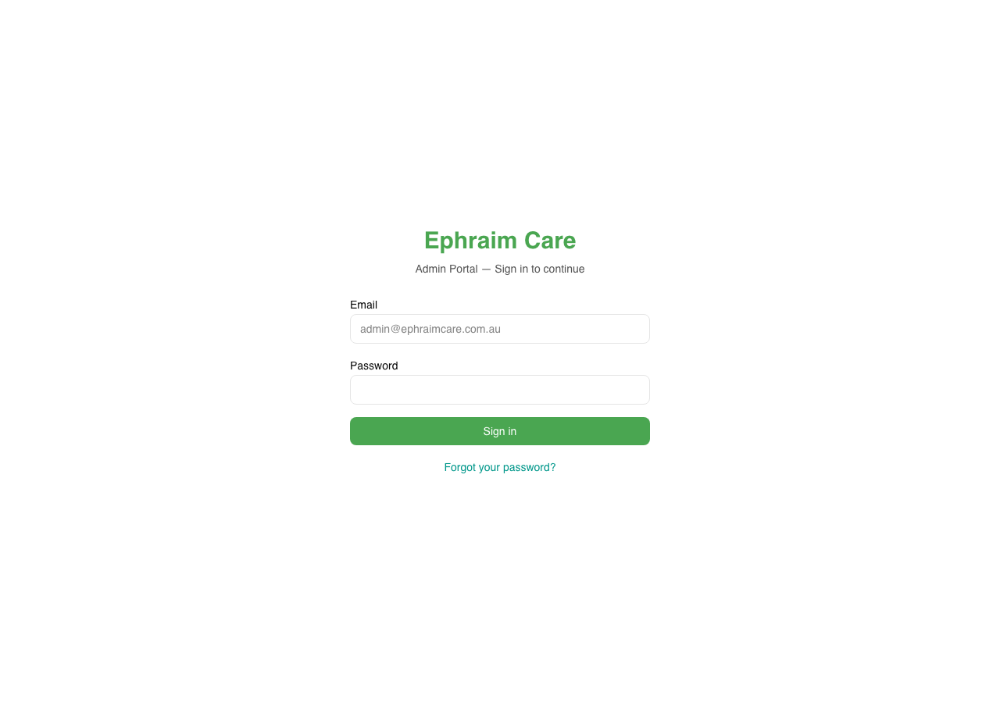
*^ This is your login page. Type email + password, then click the green "Sign in" button.*

### Participant Portal (for your clients)
1. Go to [ephraimcare-participant-portal.vercel.app](https://ephraimcare-participant-portal.vercel.app)
2. Type the client's email and password
3. Click **Sign in**

*^ This is what your clients see. Same thing — email, password, sign in.*

### Forgot Password?
Click **"Forgot your password?"** on any login page. Enter the email address and click **"Send reset link"**. A password reset email will be sent to that address. Click the link in the email to set a new password.

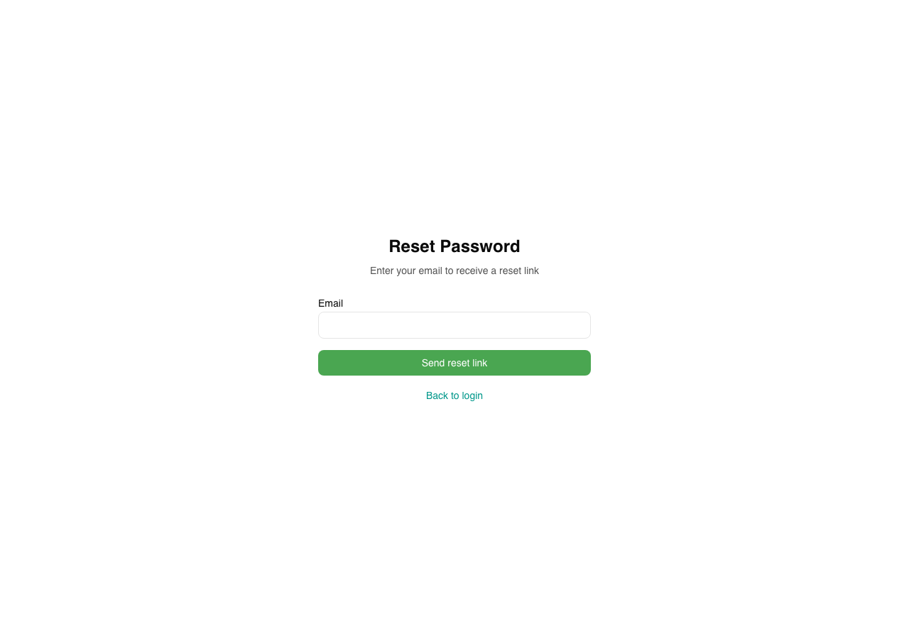
*^ Enter email, click "Send reset link". Check inbox for the link.*

### Changing Your Password
1. Log in to the Admin Portal
2. Click **"Settings"** in the left sidebar (bottom of the list)
3. Click **"Change Password"**
4. Type your new password and confirm it
5. Click **Save**

### Adding a New User
- **New admin/coordinator:** Ask your developer to create the account in Supabase
- **New worker (staff):** Go to Workers --> Add Worker --> fill in their email --> they get a magic link invitation email
- **New participant (client):** Go to Participants --> Add Participant --> fill in their details

---

## Admin Portal — What You Can Do

### 1. Dashboard (Home Page)
When you log in, you see your dashboard. It shows:
- **How many participants** you have (clients)
- **How many workers** are active (staff)
- **Today's shifts** count
- **Pending invoices** count
- **Quick Actions** — buttons to create shifts, add participants, invite workers, manage invoices
- **Compliance Status** — shows if all workers have valid screening checks
- **Upcoming Shifts** — your next scheduled shifts

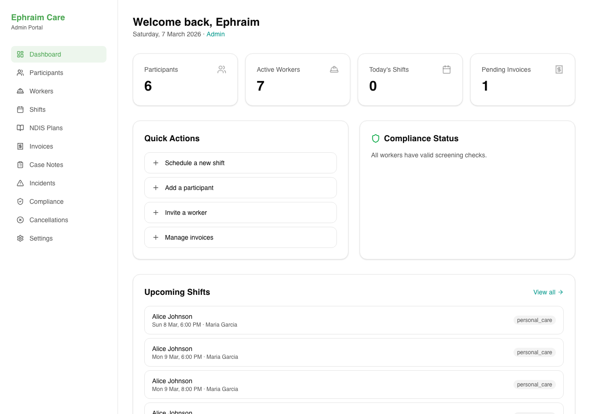
*^ Your home screen. The 4 boxes at the top show your numbers at a glance. "Quick Actions" on the left lets you jump to common tasks.*

---

### 2. Participants (Your NDIS Clients)
Click **"Participants"** in the left sidebar.

**What you can do here:**
- See all your NDIS clients in a list
- Search and filter by name
- Click on a participant to see their full details
- **Add a new participant** — click the button at the top right
- Edit participant info (name, NDIS number, phone, address, etc.)

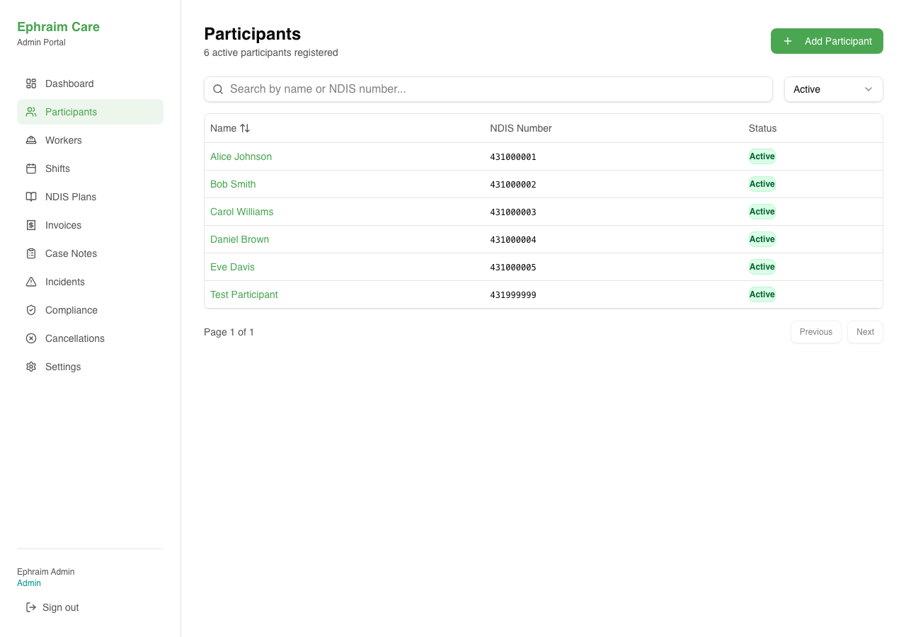
*^ Your client list. Click any name to see their full profile. Use the search bar to find someone quickly.*

---

### 3. Workers (Your Support Staff)
Click **"Workers"** in the left sidebar.

**What you can do here:**
- See all your support workers
- Search and filter workers
- See each worker's compliance status (NDIS check, WWCC)
- **Add a new worker** — click "Add Worker" button at the top right

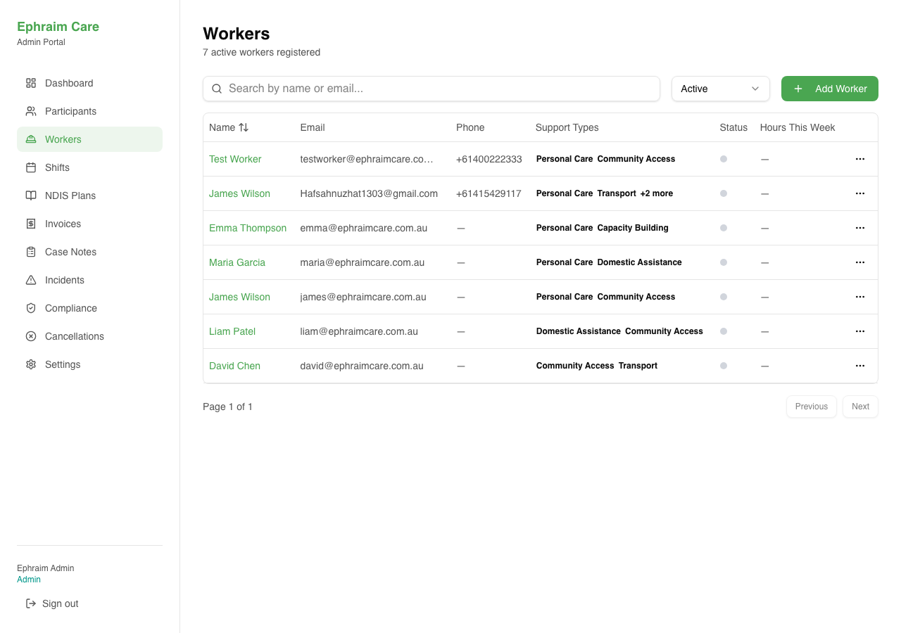
*^ Your staff list. Green badges = compliant. Click a worker's name to see their full profile, hours worked, and next shift.*

#### Adding a New Worker (Magic Link Invite)
When you add a new worker:
1. Fill in their name, **email**, phone
2. Tick which support types they can do (Personal Care, Community Access, etc.)
3. Add their qualifications and hourly rate
4. Add their NDIS Check and WWCC numbers (optional — can do later)
5. Click **"Create Worker"**

They'll get an **invitation email** with a magic link. They click it, set their password, and they're in.

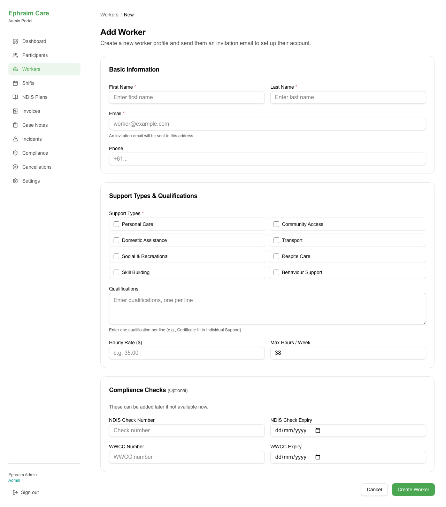
*^ Fill in the worker's details. The email field is where the invitation gets sent. "Support Types" checkboxes control which shifts they can be assigned to.*

---

### 4. Shifts (Scheduling)
Click **"Shifts"** in the left sidebar.

**What you can do here:**
- See all shifts for the week (list view)
- Switch to **Calendar** view or **Recurring** shifts
- Filter by participant, worker, status, or support type
- Navigate weeks with the arrow buttons
- Click any shift to see its full details (edit, cancel, delete)
- Click **"+ New Shift"** to create a new one

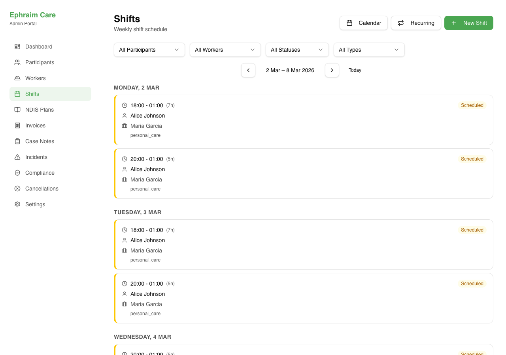
*^ Your weekly shift schedule. Each card shows the time, participant name, worker name, and type. "Scheduled" in green means it's confirmed.*

#### Creating a New Shift
1. Click **"+ New Shift"** (green button, top right)
2. Pick a **Participant** (client)
3. Pick a **Support Type** (Personal Care, Community Access, etc.)
4. Pick a **Worker** — only workers qualified for that support type will show
5. Pick the **Date** and **Start Time**
6. Pick the **Duration** (1h, 1.5h, 2h, 3h, 4h, 8h, or custom)
7. Add **Notes** if needed (optional)
8. Click **"Schedule Shift"**

The system will warn you if:
- The worker has another shift at the same time (overlap)
- The worker's NDIS check has expired
- The shift is outside the participant's NDIS plan dates

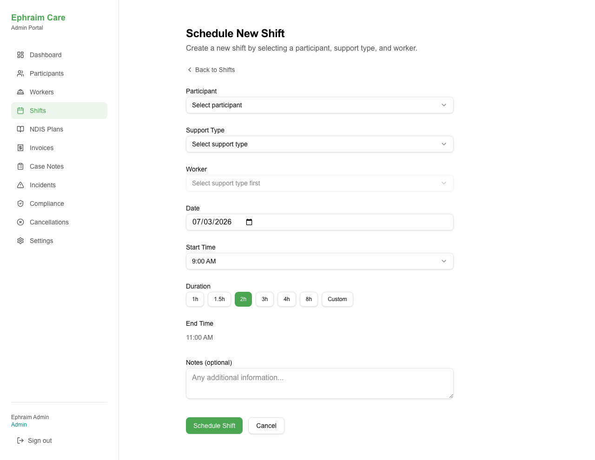
*^ Fill in each field top to bottom. "Duration" buttons let you quickly pick common lengths. The end time calculates automatically.*

#### Editing a Shift
Click any shift in the list --> a detail panel slides open --> click **"Edit"** --> change what you need --> save.

#### Cancelling a Shift
Click the shift --> click **"Cancel Shift"** --> type a reason --> confirm. The worker and participant both get a notification email.

#### Deleting a Shift
Click the shift --> click **"Delete"** --> confirm. This permanently removes it (only works for shifts that haven't been completed).

---

### 5. NDIS Plans
Click **"NDIS Plans"** in the left sidebar.

View and manage NDIS plans for your participants. Each plan shows the start/end dates and budget allocations.

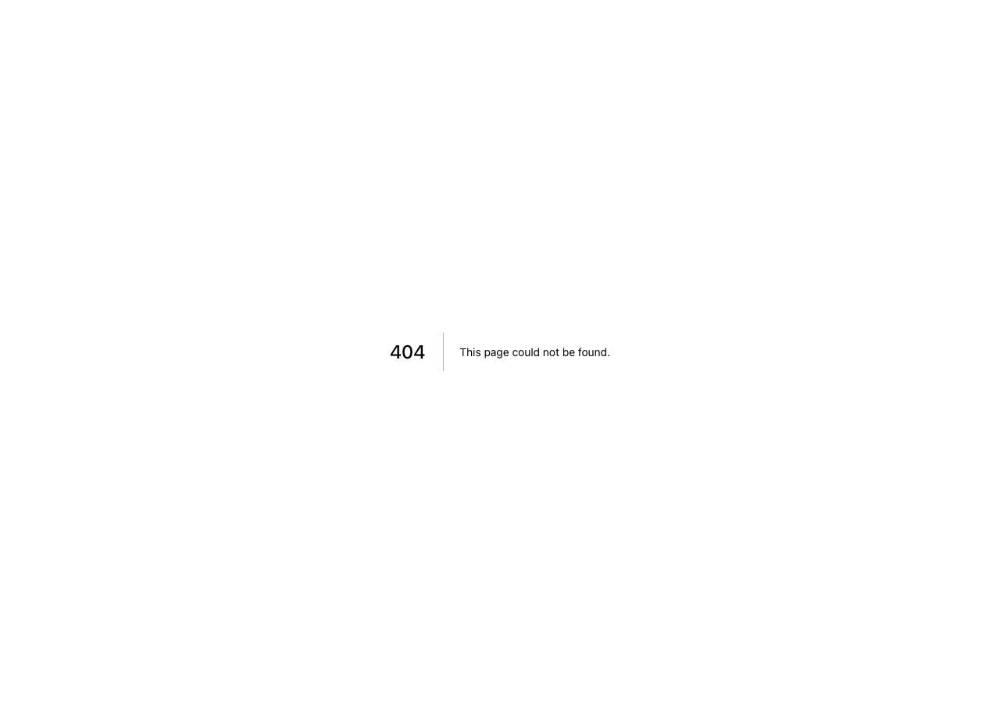

---

### 6. Invoices
Click **"Invoices"** in the left sidebar.

**What you can do here:**
- See all invoices (draft, pending, paid)
- Filter by status
- Click an invoice to see line items
- Generate new invoices from completed shifts

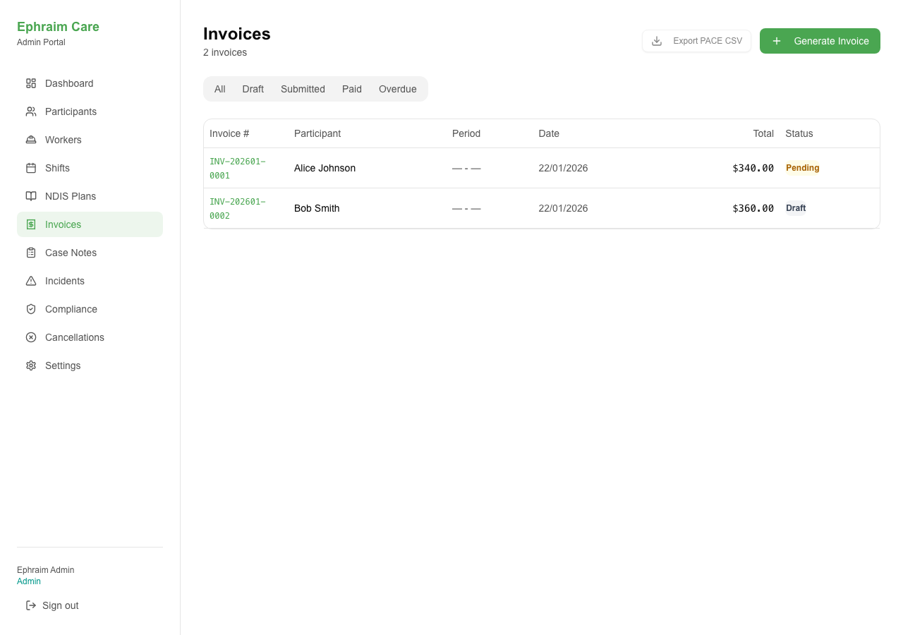
*^ Your invoice list. Each row shows the participant, amount, status, and date.*

---

### 7. Case Notes
Click **"Case Notes"** in the left sidebar.

Workers write case notes after shifts. You can read them all here. Each note is linked to a shift and a participant.

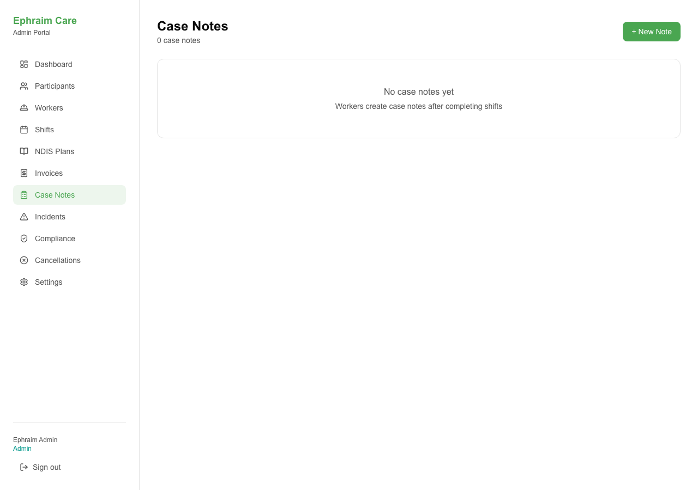

---

### 8. Incidents
Click **"Incidents"** in the left sidebar.

Log and track incidents (falls, injuries, behaviour incidents, etc.). Incidents that need to be reported to the NDIA show a red warning banner with a countdown timer.

**What you can do here:**
- Create new incidents
- Mark severity (low, medium, high, critical)
- Track NDIA reporting status
- Close/reopen incidents
- Link incidents to participants, workers, and shifts

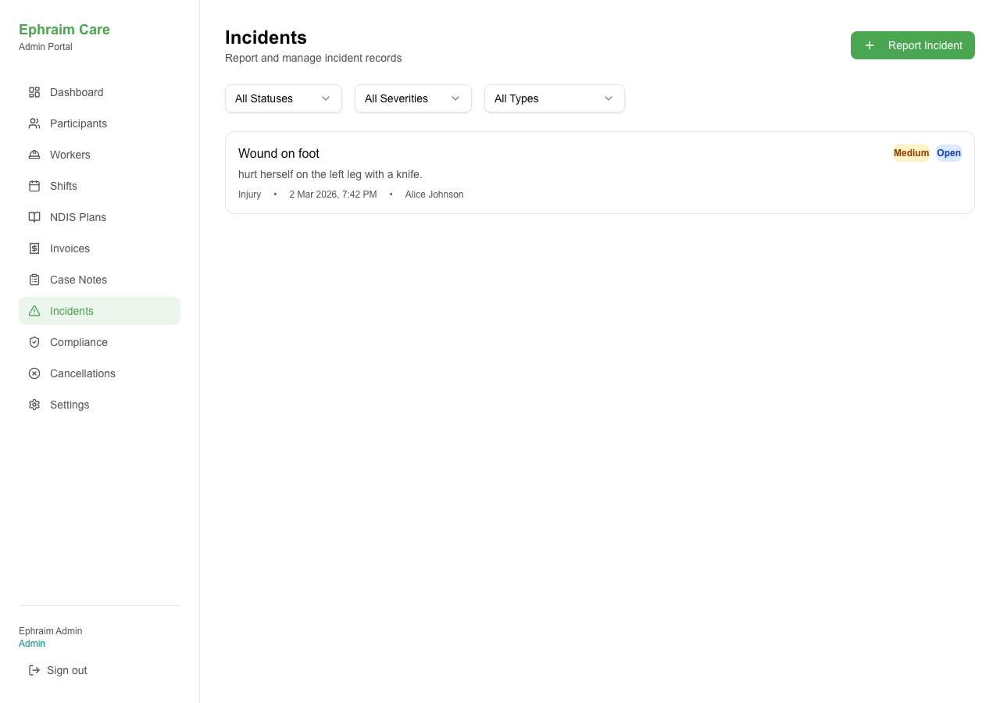

---

### 9. Compliance
Click **"Compliance"** in the left sidebar.

See a dashboard showing which workers are compliant and which have expired or expiring checks.

- Green = all good
- Yellow = expiring soon
- Red = expired (cannot be assigned shifts)

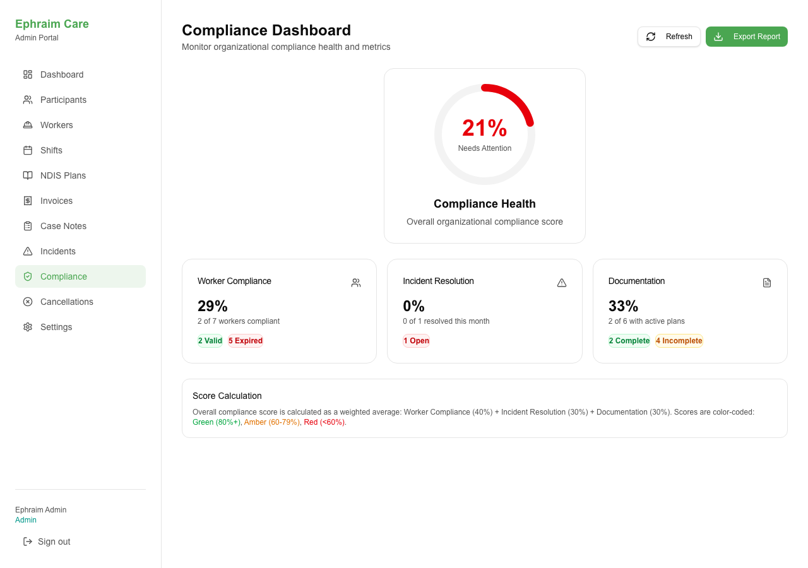
*^ At a glance, you can see who needs to renew their checks. The system blocks shift assignments for workers with expired NDIS checks.*

---

### 10. Cancellation Requests
Click **"Cancellations"** in the left sidebar.

When a participant requests to cancel a shift (from their portal), it shows up here for you to approve or reject.

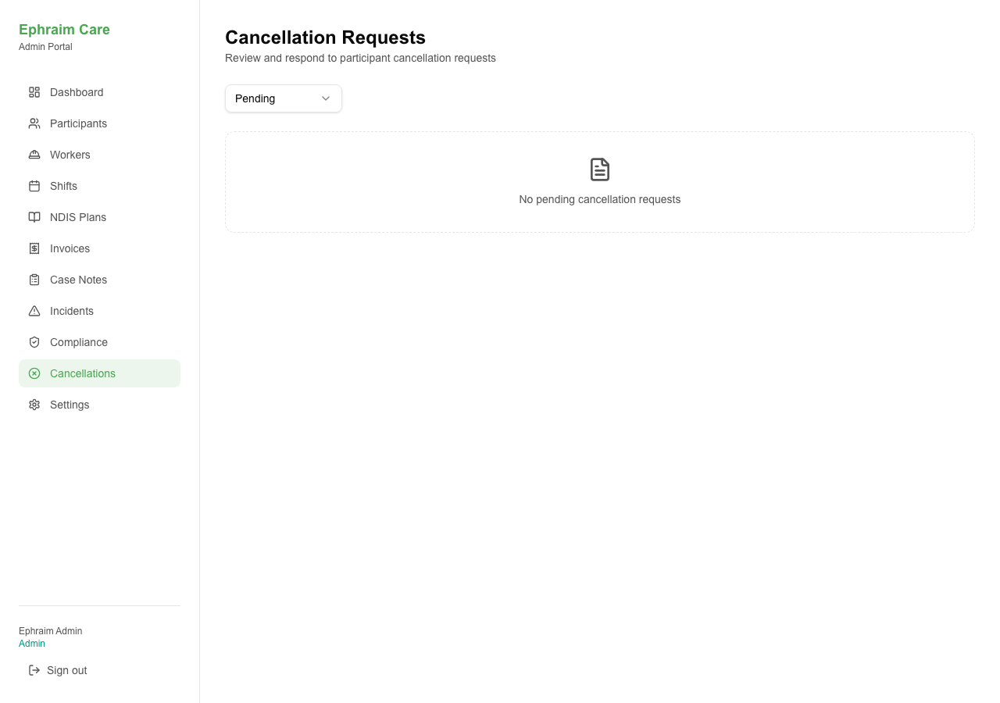

---

### 11. Settings
Click **"Settings"** in the left sidebar.

**What you can do here:**
- Change your password
- Update your organization details
- Sign out

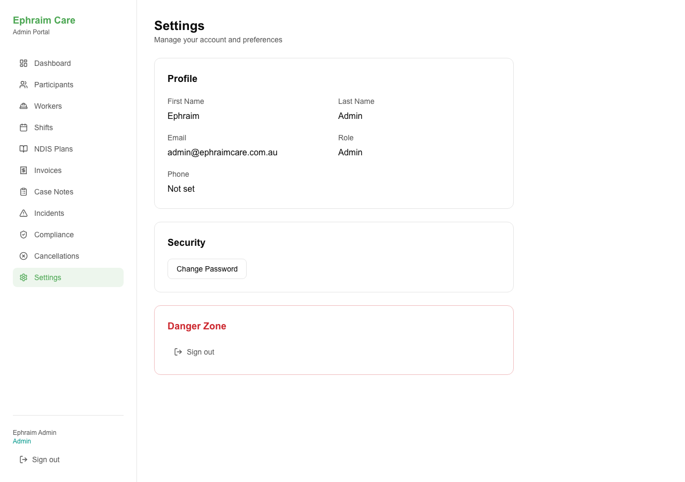

---

### Signing Out
Click **"Sign out"** at the bottom of the left sidebar. You'll be taken back to the login page.

---

## Participant Portal — What Your Clients See

### 1. Dashboard
After logging in, participants see their dashboard with:
- **Budget Status** — how much of their NDIS budget is used
- **Plan Period** — their current plan dates
- **Upcoming Appointments** — their next scheduled shifts

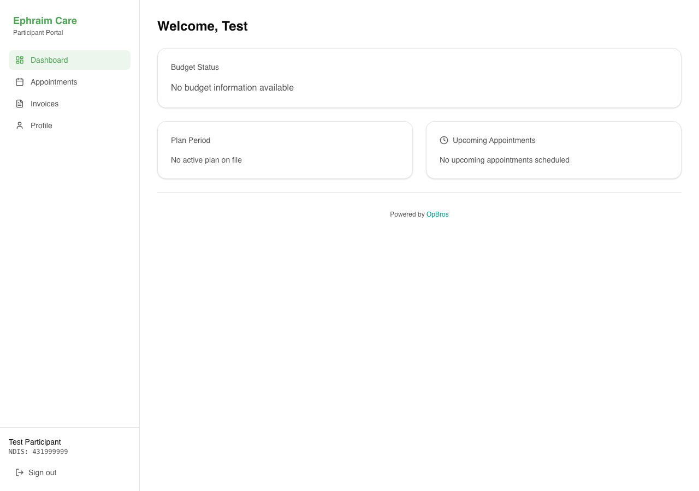
*^ Simple and clean. Your clients see their budget, plan dates, and upcoming appointments at a glance.*

---

### 2. Appointments
Click **"Appointments"** in the left sidebar.

Participants see their upcoming shifts listed as appointment cards. Each card shows:
- Date and time
- Worker name (who's coming)
- Support type
- Any notes

They can also **request to cancel** an appointment by clicking the cancel button and giving a reason. This sends a request to you (admin) for approval.

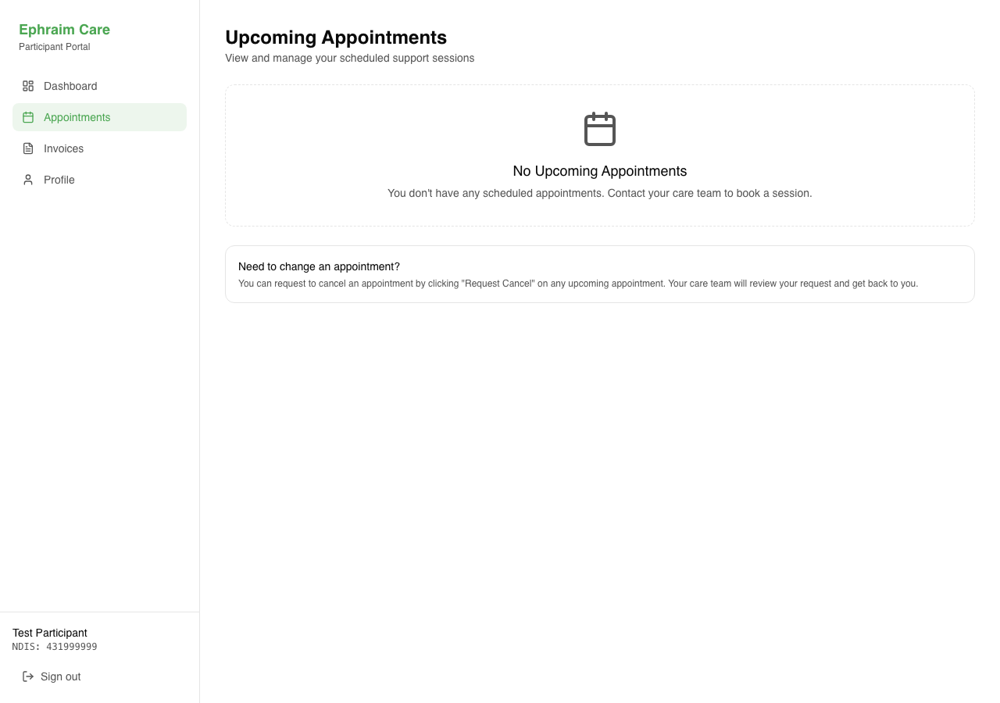

---

### 3. Invoices
Click **"Invoices"** in the left sidebar.

Participants can view their invoices (non-draft only). They can see amounts, dates, and statuses.

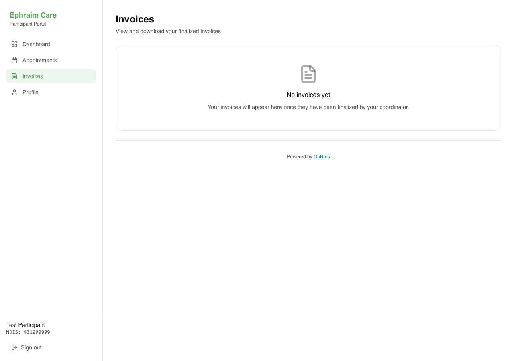

---

### 4. Profile
Click **"Profile"** in the left sidebar.

Participants can view and edit their personal information — name, phone, address, emergency contact.

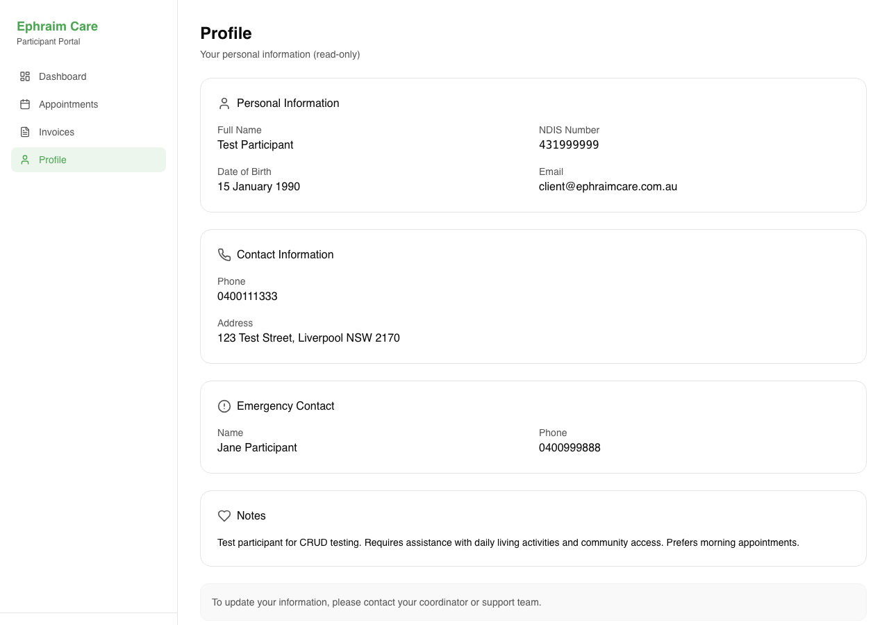

---

### 5. Signing Out
Click **"Sign out"** at the bottom left. Takes them back to the login page.

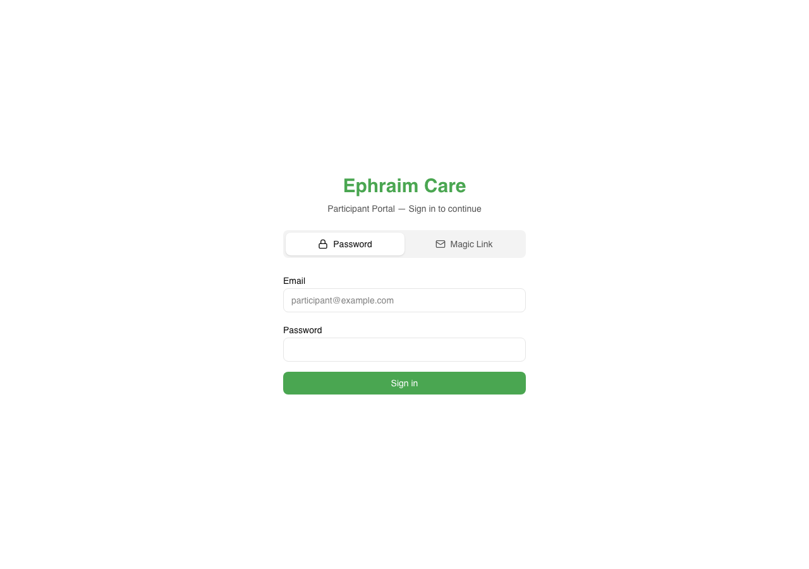

---

## Worker Mobile App — What Your Staff Use

The mobile app (Expo/React Native) lets workers:
- **View their assigned shifts** — see what's coming up
- **GPS Check-in** — when they arrive, they tap "Check In" and their GPS location is recorded
- **GPS Check-out** — when they finish, they tap "Check Out" and the shift duration is calculated
- **Write case notes** — after a shift, they can write notes about what happened
- **Auto-checkout** — if a worker forgets to check out, the system automatically completes the shift 30 minutes after the scheduled end time

> The mobile app is built and tested but not yet published to the App Store / Google Play. It runs on both iPhone and Android.

---

## What Was Built and Fixed (Full List)

### Core Features Built
1. Full admin dashboard with live stats (participants, workers, shifts, invoices)
2. Participant management — create, edit, view all NDIS clients
3. Worker management — add workers via email invite (magic link), track compliance
4. Shift scheduling — create, edit, delete, cancel shifts with conflict detection
5. Calendar view — week/month/day views for shift visualization
6. Recurring shifts — set up weekly repeating shift patterns
7. Invoice management — generate, view, track payment status
8. Case notes — workers write, admins review
9. Incident reporting — create, track, NDIA reporting countdown
10. Compliance dashboard — NDIS check + WWCC tracking with expiry alerts
11. Cancellation request workflow — participant requests, admin approves/rejects
12. NDIS plan management — track plan dates and budgets
13. Participant portal — clients see their dashboard, appointments, invoices, profile
14. Worker mobile app — GPS check-in/out, case notes, push notifications
15. SMS reminders — 24h and 2h shift reminders to workers + participants (via Twilio)
16. Email notifications — shift assigned, shift cancelled, worker invited (via Resend)
17. Password reset — "Forgot password" flow sends reset email
18. Organization-scoped security — each organization only sees their own data (RLS)

### Bugs Fixed (Stability Audit — March 2026)
1. **Login/Logout** — fixed session clearing, logout now works cleanly on both portals
2. **Magic link invites** — worker invitations now send actual emails via Resend API
3. **Staff list not loading** — fixed query/RLS issue that blocked the workers page
4. **Shift edit not saving** — fixed timezone bug where 9:00 AM Sydney was stored as 9:00 AM UTC (10 hours off)
5. **Shift delete not working** — fixed stale Supabase client inside the delete mutation
6. **Shift cancel flow** — fixed and tested, now sends cancellation emails
7. **All dates/times now use Sydney timezone** — every timestamp in both portals shows correct Australian Eastern time
8. **Cache staleness** — all mutations now properly invalidate React Query cache (no more stale data after edits)
9. **Photo upload security** — added authentication + role checks to the photo upload API
10. **Removed exposed migration endpoint** — deleted a security risk that allowed SQL execution
11. **Participant cancellation requests** — cache now updates immediately after requesting or approving
12. **Dead link in incidents** — fixed broken shift link that pointed to a non-existent page
13. **Password change** — Settings page "Change Password" button now works

### Automated Tests (All Passing)
- **39 E2E tests** across both portals — all green
- Auth tests (login, logout, forgot password, invalid credentials, redirect)
- Full admin workflow (dashboard, every page, create/edit/delete shifts, workers, participants)
- Full participant workflow (dashboard, appointments, invoices, profile, cancel request, logout)
- CRUD operations (shifts, participants, case notes, incidents, compliance)
- Staff/worker management (list, search, filter, detail, invite form, compliance)

---

## Test Results (7 March 2026)

| Test Suite | Tests | Result |
|-----------|-------|--------|
| Admin Auth | 5 | ALL PASSED |
| Admin Workflow | 6 | ALL PASSED |
| Admin CRUD Operations | 10 | ALL PASSED |
| Admin Worker/Staff Flow | 8 | ALL PASSED |
| Participant Workflow | 4 | ALL PASSED |
| Participant CRUD | 6 | ALL PASSED |
| **TOTAL** | **39** | **ALL PASSED** |

---

## Tech Stack (For Your Developer)

| Layer | Technology |
|-------|-----------|
| Public Website | Next.js 14, TypeScript, Tailwind CSS, Radix UI, Motion, ElevenLabs Voice AI |
| Admin Portal | Next.js 15, React 19, Tailwind CSS v4, shadcn/ui |
| Participant Portal | Next.js 15, React 19, Tailwind CSS v4, shadcn/ui |
| Worker Mobile App | Expo 53, React Native |
| Database | Supabase (PostgreSQL) with Row Level Security |
| Auth | Supabase Auth (email/password + magic links) |
| Hosting | Vercel (auto-deploy from GitHub) |
| Email | Resend API |
| SMS | Twilio (Australian number) |
| Notifications | n8n Webhooks (SMS, WhatsApp, Telegram, Email) |
| Monorepo | Turborepo + pnpm workspaces |
| State | TanStack React Query + Zustand |
| Repos | Private GitHub: `cleanupbro/ephraimcare-NDIS-portal` (portal) + `ephraimcarerepo1` (website) |

---

## Important Notes

- **All times are in Sydney timezone (AEST/AEDT)** — the system handles daylight saving automatically
- **Organization-scoped** — if you ever add a second organization, their data is completely separate
- **Auto-deploy** — when code is pushed to the `main` branch on GitHub, both portals automatically redeploy to Vercel within 2-3 minutes
- **Worker NDIS check enforcement** — workers with expired NDIS checks **cannot** be assigned to shifts (hard block)
- **Auto-checkout** — a background job runs every 5 minutes and auto-completes shifts where the worker forgot to check out (30 min after scheduled end)

---

## What This Would Cost to Build (Real 2025-2026 Market Pricing)

This pricing is based on real Australian developer rates researched from 15 industry sources including Lancebase, Intracode, Codewave, Devstree, AppInventiv, Enterprise Monkey, 7Pillars, Fullstack, and Basecode — all Australian software industry pricing guides for 2025-2026.

### What was built (scope summary)
- Public business website with contact forms, service pages, and voice AI
- Admin portal with 12+ pages (dashboard, participants, workers, shifts, invoices, case notes, incidents, compliance, cancellations, NDIS plans, settings)
- Participant self-service portal (dashboard, appointments, invoices, profile)
- Worker mobile app with GPS check-in/out and case notes
- SMS + email notification system (shift reminders, cancellations, invitations)
- NDIS compliance (incident reporting with NDIA countdown, worker screening checks, plan date tracking)
- Full database with Row Level Security (organization-scoped, role-based access)
- 39 automated E2E tests
- Stability audit + 13 bug fixes

### Estimated hours for this scope
| Component | Hours |
|-----------|-------|
| Web admin + participant portal (Next.js + Supabase) | 500-700 |
| Rostering, GPS check-in, scheduling with conflict detection | 250-400 |
| Invoicing + NDIA-aligned exports | 150-250 |
| Incident reporting, case notes, audit trails | 150-250 |
| Notifications (SMS/email), templates, preferences | 80-140 |
| React Native worker app (schedules, GPS, notes) | 350-550 |
| Public website (design, content, forms, voice AI) | 150-250 |
| Testing, refactoring, infra, documentation | 150-250 |
| **TOTAL** | **1,780-2,790 hours** |

### What it would cost at real Australian rates

| Who Builds It | Rate (AUD/hr) | Hours | Total Cost (AUD) |
|---------------|---------------|-------|-----------------|
| **Solo Freelancer** | $100-$140/hr | 1,780-2,790 | **$180,000 - $300,000** |
| **Small Agency** (2-5 people) | $140-$220/hr | 1,850-2,900 | **$250,000 - $450,000** |
| **Mid-size Company** (20-100 people) | $200-$280/hr | 2,150-3,400 | **$400,000 - $750,000+** |

> Australian freelance full-stack developers charge $80-$180 AUD/hour (source: Lancebase, Basecode).
> Australian custom software agencies quote $90-$200 AUD/hour (source: Intracode, Codewave).
> Mid-sized app builds in Australia range $80,000-$200,000 for app-only, with multi-surface compliance-heavy systems reaching $300,000-$750,000+ (source: Codewave, 7Pillars, AppInventiv).

### What you paid

| Item | Cost |
|------|------|
| Everything listed above | **$5,000 AUD** |

That's **2-3% of what a solo freelancer would charge**, and **less than 1%** of what a mid-size company would quote.

You got a $250K-$450K system for $5K. That's the value of working with OpBros.ai.

---

*Built with care by OpBros.ai. All screenshots captured from live production on 7 March 2026. Pricing research conducted via Perplexity AI deep search across 15 Australian industry sources.*
